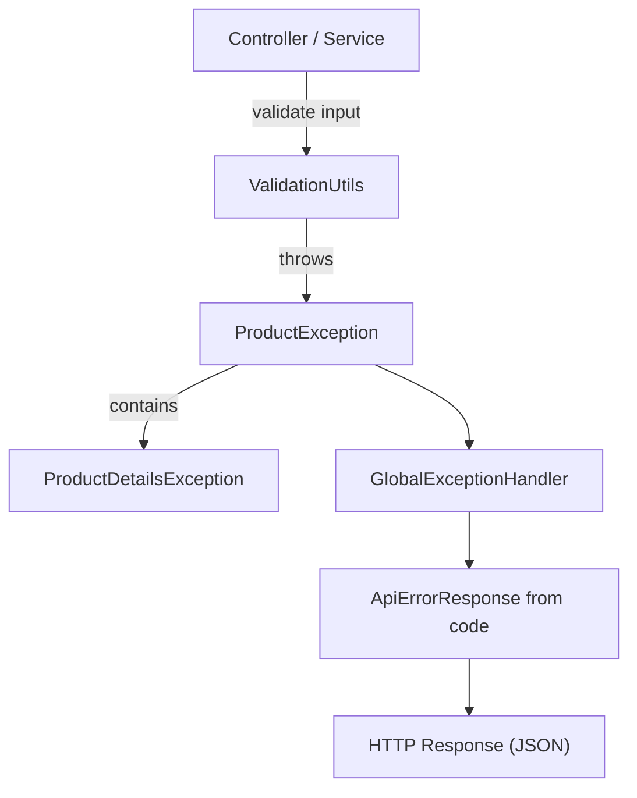
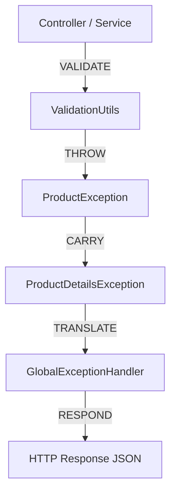

# Spring Boot Global Exception Handling 

### @RestControllerAdvice
✅ Architect-level answer

**@RestControllerAdvice is a composed annotation that combines global controller advice,
automatic response body serialization, runtime retention, 
type-level targeting, and documentation visibility.**

### `@RestControllerAdvice`
#### @RestControllerAdvice = @ControllerAdvice + @ResponseBody

`@RestControllerAdvice` is a **composed annotation** in Spring.

Internally, it combines:

- **`@ControllerAdvice`**  
  Enables global exception handling and cross-cutting concerns across controllers.

- **`@ResponseBody`**  
  Ensures returned objects are automatically serialized into HTTP responses (JSON/XML).

- **Meta-annotations**
    - **`@Target`** – Restricts where the annotation can be applied
    - **`@Retention`** – Defines the lifecycle of the annotation (runtime availability)
    - **`@Documented`** – Includes the annotation in generated documentation

Together, these enable **centralized REST-specific exception handling** with proper serialization, lifecycle control, and documentation support.
classDiagram
direction TB

    class ExceptionCode {
        <<interface>>
        +getKey()
        +getLabel()
        +getStatus()
        +getType()
        +getSeverity()
    }

    class ProductDetailsException {
        <<enum>>
        -int status
        -String label
        -FeedbackType type
        -FeedbackSeverity severity
        +getKey()
        +getLabel()
        +getStatus()
        +getType()
        +getSeverity()
    }

    class ProductException {
        -ProductDetailsException code
        +getCode()
    }

    class ApiErrorResponse {
        -String code
        -String message
        -String type
        -int status
        -Instant timestamp
        +from(ExceptionCode)
    }

    ExceptionCode <|.. ProductDetailsException
    ProductDetailsException *-- ProductException
    ExceptionCode <.. ApiErrorResponse

**Runtime Flow Diagram (Sequence)**

# Product API Exception Handling Flow



#### 1️⃣ BUS — Business Exception

#### Definition

###### A business rule or domain constraint is violated.

#### Examples

1. Invalid product ID
2. Missing mandatory fields
3. Duplicate booking
4. Invalid date range
5. Invalid input format
```java
 SB_PL_INVALID_INPUT_DATA(400, "Invalid input data.", BUS);
```


#### 2️⃣ SEC — Security Exception

###### Definition

###### A security rule is violated (authentication or authorization).

###### Examples

1. Invalid JWT
2. Expired token
3. Missing Authorization header
4. Role not allowed
```java
SB_PL_UNAUTHORIZED(401, "Unauthorized", SEC)
SB_PL_FORBIDDEN(403, "Forbidden", SEC)

```
#### 3️⃣ TEC — Technical Exception
##### Definition

###### System or infrastructure failure
#### Examples

Database unavailable

1. Kafka down
2. Timeout
3. NullPointerException
4. Serialization failure

#### 1️⃣ Core Idea

### Exception type decides behavior, not controller logic.

| Type | Responsibility                 | HTTP    | Logging       |
|------|--------------------------------|---------|---------------|
| BUS  | Client / Business              | 400–422 | WARN          |
| SEC  | Authentication / Authorization | 401–403 | WARN / AUDIT  |
| TEC  | System / Infra                 | 500–503 | ERROR + ALERT |

This answers:

1. ❓ Who is responsible?
2. ❓ Which layer does it belong to?

#### Quick Comparison Table (Memorize This)

| Severity | Meaning                    | Who Fixes It | HTTP Range | Log Level |
|----------|----------------------------|--------------|------------|-----------|
| INFO     | Normal operation           | Nobody       | 2xx        | INFO      |
| WARN     | Client / business issue    | Client       | 4xx        | WARN      |
| ERROR    | System / technical failure | Dev / Ops    | 5xx        | ERROR     |

This answers:

1. ❓ How bad is it operationally?
2. ❓ Should we alert someone?

How to Explain This in an Interview (Perfect Answer)

#### “FeedbackType classifies the nature of the error—business, security, or technical—while

**FeedbackSeverity represents the operational impact. They are orthogonal dimensions. Type drives responsibility, 
severity drives logging and alerting.”**

### Severity vs Type Matrix

| TYPE \ SEVERITY | INFO | WARN | ERROR |
|-----------------|------|------|-------|
| BUS (Business)  | ✔    | ✔    | ❌     |
| SEC (Security)  | ✔    | ✔    | ✔     |
| TEC (Technical) | ✔    | ✔    | ✔     |

**They are orthogonal dimensions.**

