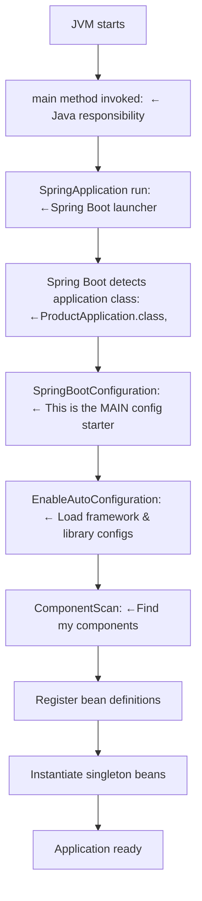
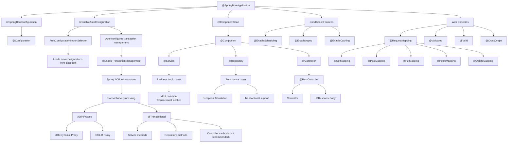
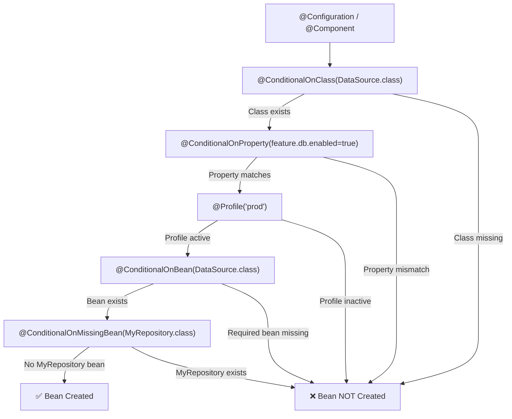

# @SpringBootApplication

`@SpringBootApplication` declares the **intent to bootstrap a Spring Boot application**, while  
`SpringApplication.run()` **executes the startup lifecycle** by:

- Loading configuration
- Wiring beans
- Creating the application context
- Starting the runtime environment

---

## 2️⃣ Memorize the 3-Annotation Formula (Non-Negotiable)

This is the **core memory anchor** for understanding Spring Boot startup:


### @SpringBootApplication = @SpringBootConfiguration + @EnableAutoConfiguration+ @ComponentScan
## @SpringBootApplication – Annotation Breakdown

`@SpringBootApplication` is a **composed annotation** that combines three critical responsibilities required to bootstrap a Spring Boot application.

| Annotation                 | Purpose                               | What It Actually Does                                                                       | Why It Is Needed                                                              |
|----------------------------|---------------------------------------|---------------------------------------------------------------------------------------------|-------------------------------------------------------------------------------|
| `@SpringBootConfiguration` | Marks the main class as configuration | Indicates this class provides Spring bean definitions (internally extends `@Configuration`) | Allows Spring to treat this class as the **primary source of configuration**  |
| `@EnableAutoConfiguration` | Enables auto-configuration            | Automatically configures beans based on classpath, properties, and environment              | Removes manual configuration and follows **convention over configuration**    |
| `@ComponentScan`           | Scans for Spring components           | Scans packages for `@Component`, `@Service`, `@Repository`, `@Controller`, etc.             | Automatically registers application beans without explicit XML or Java config |

---

### 🧠 Memory Hook (Interview-Friendly)

**CAS Formula**

| Letter | Meaning            |
|--------|--------------------|
| **C**  | Configuration      |
| **A**  | Auto-Configuration |
| **S**  | Scan               |

👉 If you remember **CAS**, you understand **Spring Boot startup**.

---

### 🎯 One-Line Interview Answer

> `@SpringBootApplication` is a composed annotation that **declares configuration**, **enables conditional auto-configuration**, and **scans application components**, forming the controlled bootstrap mechanism of Spring Boot.
# Spring Boot Application Startup Flow

This document explains the **high-level lifecycle of a Spring Boot application**
from JVM startup to application readiness.

---

## 🚀 Spring Boot Startup Sequence




## Architectural Perspective

`@SpringBootApplication` acts as a **controlled bootstrap mechanism** that:

- Enables **auto-configuration**
- Triggers **component scanning**
- Initializes the **application context**

All of this happens in a **predictable, conditional, and opinionated manner**, following
Spring Boot’s *convention over configuration* philosophy.

---

## Bootstrap Lifecycle vs Spring Boot Application Lifecycle

### Short, Precise Answer

They are **NOT the same**.

The **bootstrap lifecycle** is a **subset** of the **Spring Boot application lifecycle**.

### Correct Relationship

Spring Boot Application Lifecycle

└── Bootstrap Lifecycle (Startup phase)


**In simple terms:**

- **Bootstrap lifecycle** → *How the application starts*
- **Spring Boot lifecycle** → *Start → Run → Shutdown*

---

## 1️⃣ Bootstrap Lifecycle (Startup Only)

### What It Is

The **bootstrap lifecycle** is the initial startup sequence that brings the application from a **zero state** to a **running state**.

### When It Runs

- Runs **once**
- Happens **before** the application starts serving requests

### Responsibilities

- Load configuration
- Prepare environment
- Create `ApplicationContext`
- Auto-configure beans
- Wire dependencies
- Start embedded server

### Key Trigger

```java
SpringApplication.run(ProductApplication.class, args)
internally called ConfugrationApplicationContext to run method

```
## 2️⃣ Spring Boot Application Lifecycle (Full Lifecycle)

### What It Is

The **complete lifecycle** of a Spring Boot application from **startup to shutdown**.

### Includes

- Bootstrap lifecycle ✅  
- Runtime lifecycle  
- Shutdown lifecycle  

---

## 3️⃣ Spring Boot Lifecycle Phases (Complete View)

### Phase 1: Bootstrap Lifecycle

- Configuration loading  
- ApplicationContext creation  
- Auto-configuration  
- Embedded server startup  

### Phase 2: Runtime Lifecycle

- Handling HTTP requests  
- Business logic execution  
- Scheduling jobs  
- Messaging  
- Health checks  

### Phase 3: Shutdown Lifecycle

- Graceful shutdown  
- Closing resources  
- `@PreDestroy` execution  
- ApplicationContext close events  

---

## 🎯 One-Line Interview Answer

> The bootstrap lifecycle handles **startup and initialization**, while the Spring Boot application lifecycle covers **startup, runtime operations, and graceful shutdown**.



```text


@SpringBootApplication
├── composed of @SpringBootConfiguration
│   └── @Configuration
│
├── composed of @EnableAutoConfiguration
│   ├── imports AutoConfigurationImportSelector
│   │    └── loads auto-configurations from classpath
│   │
│   └── auto-configures transaction management
│        └── equivalent to @EnableTransactionManagement
│             └── activates Spring AOP infrastructure
│                  └── enables @Transactional processing
│                       └── creates AOP proxies (JDK / CGLIB)
│                            └── @Transactional
│                                 ├── applied on @Service methods (most common)
│                                 ├── applied on @Repository methods
│                                 └── occasionally on @Controller (not recommended)
│
├── composed of @ComponentScan
│   └── discovers @Component
│        ├── @Service
│        │    └── primary layer for business logic
│        │         └── most common place for @Transactional
│        │
│        ├── @Repository
│        │    └── persistence layer
│        │         └── supports @Transactional + exception translation
│        │
│        └── @Controller
│             └── @RestController
│                  ├── @Controller
│                  └── @ResponseBody
│
├── conditionally activates features
│   ├── @EnableScheduling
│   ├── @EnableAsync
│   └── @EnableCaching
│
└── supports web concerns
├── @RequestMapping
│    ├── @GetMapping
│    ├── @PostMapping
│    ├── @PutMapping
│    ├── @PatchMapping
│    └── @DeleteMapping
│
├── @Validated
├── @Valid
└── @CrossOrigin
```

# 1️⃣ How `Enable OR Disable (package, class, bean, and property)` Works
```java
@Configuration
@ConditionalOnClass(DataSource.class) // Only load if DataSource is on classpath
@ConditionalOnProperty(name = "feature.db.enabled", havingValue = "true") // Property must be true
@Profile("prod") // Only active in 'prod' profile
@ConditionalOnBean(DataSource.class) // Ensure a DataSource bean exists
@ConditionalOnMissingBean(MyRepository.class) // Only if MyRepository bean does NOT exist
public class DbFallbackConfig {

    @Bean
    public MyRepository myRepository() {
        return new DbFallbackRepository();
    }
}

```
----

## 1️⃣ Conditional Bean Hierarchy


@ConditionalOnBean → Create this bean ONLY IF another bean already exists
@ConditionalOnMissingBean → Create this bean ONLY IF another bean does NOT exist

public class FeatureA { }
# 1️⃣ How `@ConditionalOnProperty` Works

@ConditionalOnProperty(
    name = "feature.c.enabled",
    havingValue = "true",
    matchIfMissing = false
)
## Rules for `@ConditionalOnProperty`

```java
IF property exists:
    create bean ONLY IF propertyValue == havingValue
ELSE (property missing):
    create bean ONLY IF matchIfMissing == true

```

| Property Value | havingValue | matchIfMissing | Bean Created | Reason                 |
|----------------|-------------|----------------|--------------|------------------------|
| `true`         | `true`      | any            | ✅ Yes        | Value matches          |
| `true`         | `false`     | any            | ❌ No         | Value mismatch         |
| `false`        | `false`     | any            | ✅ Yes        | Value matches          |
| `false`        | `true`      | any            | ❌ No         | Value mismatch         |
| **missing**    | any         | `true`         | ✅ Yes        | matchIfMissing applies |
| **missing**    | any         | `false`        | ❌ No         | matchIfMissing applies |

| Property Exists | propertyValue == havingValue | matchIfMissing | Bean Created |
|-----------------|------------------------------|----------------|--------------|
| ✅ Yes           | ✅ Yes                        | ignored        | ✅ Yes        |
| ✅ Yes           | ❌ No                         | ignored        | ❌ No         |
| ❌ No            | ignored                      | ✅ True         | ✅ Yes        |
| ❌ No            | ignored                      | ❌ False        | ❌ No         |


